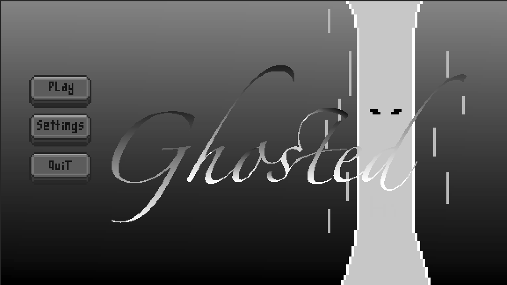
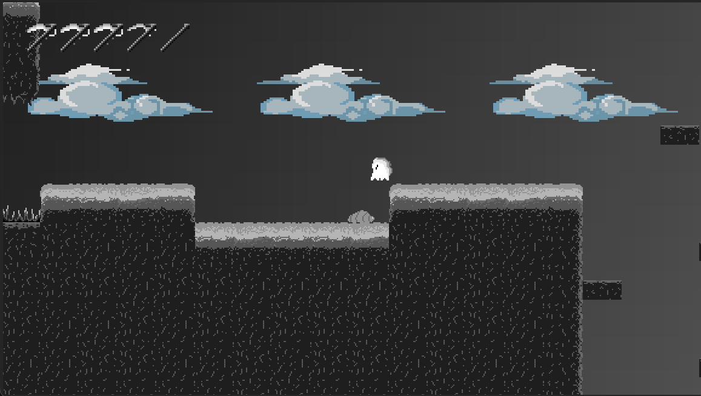

# Dots
This is a platformer/metroidvania style game built in Godot with the art made using Aseprite. It is rather simple and a work in progress at the moment, but will continue improving over the course of the next 5 weeks. With the project, the README will grow, elaborating on all the cool stuff that is in the project.

most recent updates to game: we added respawning mechanics, came up with a name for our game, smoothed out the basic mechanics, and began working on a second level. The second level has not been deployed yet, and we will be working on the transition between levels soon. Next steps will be making more enemies, levels, music, lore, and bosses. We have also thought up some ideas for the lore of our game. The game will be about a world where the color has been drained from it, and you need to collect 3 sort of powerups/crystals, Red Green and Blue, to have enough power to defeat the final boss and restore color to the world. Along the way, you brave treacherous caverns, bustling cities, and mysterious villages and meet new friends that may help you along the way.

to see images of previous development, check the images folder in the repo
previous updates:some very noice menu art was added as was new art for level tiles and hazards. hazards aren't fully functional right now, but the enemy can move around, get hit, knocked back, as can the player. dying animation for player will likely be added and integration for dying to hazards and respawning.
